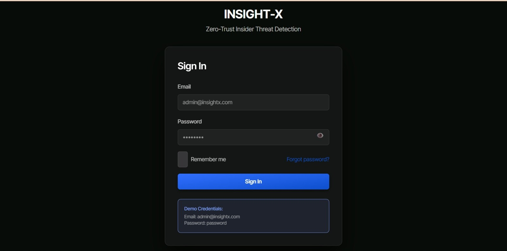
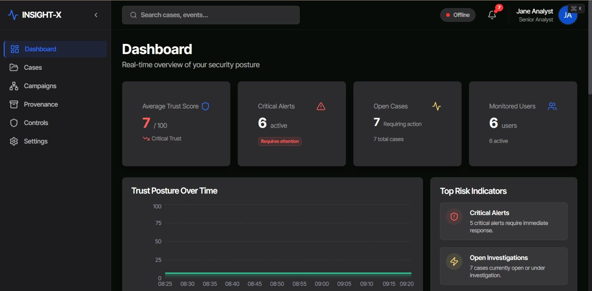
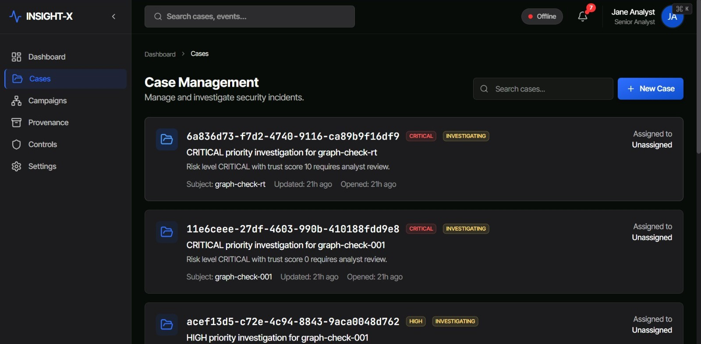
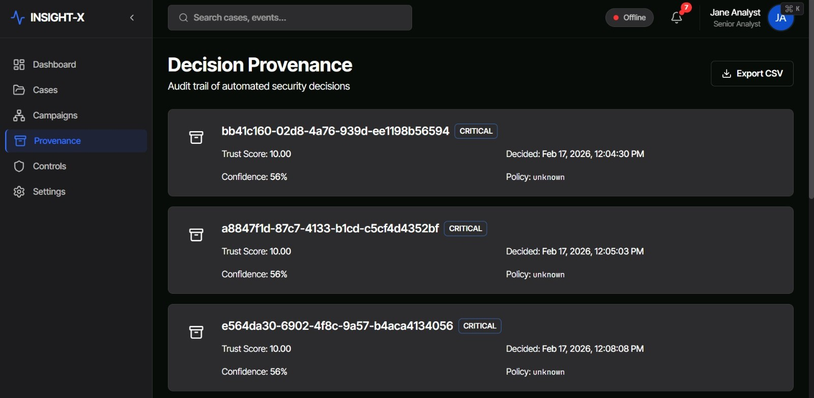
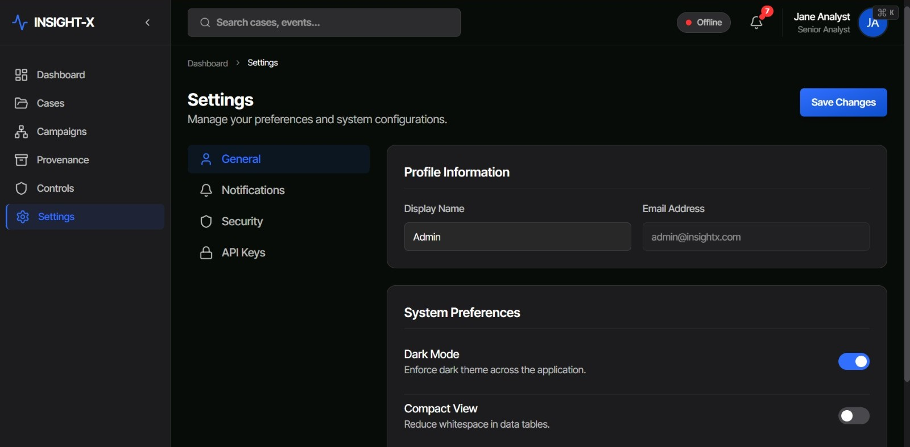

# INSIGHT-X
### An Intent-Aware and Trust-Adaptive Framework for Insider Threat Detection and Response

INSIGHT-X is a cybersecurity framework designed to detect and respond to potential insider threats by analyzing user activities, behavioral patterns, trust levels, and possible intent over time.

Instead of looking at security events separately, INSIGHT-X combines multiple signals to identify suspicious patterns and support appropriate responses.

---

## 🚀 Project Overview

Insider threats can be difficult to detect because individual user actions may look normal when viewed separately.

For example:

> A user connects a USB device → accesses sensitive files → compresses data → accesses cloud storage.

Each activity may not immediately appear malicious. However, when these activities are analyzed together and in the right context, they may indicate a potentially risky behavior pattern.

INSIGHT-X addresses this by combining:

- Continuous trust scoring
- Intent analysis
- Behavioral analytics
- Temporal graph analysis
- Event-driven processing
- Policy-based response
- Tamper-evident audit logging

The goal is to provide a more context-aware approach to insider threat detection and response.

---

## 🎯 Problem Statement

Traditional security monitoring can generate many alerts because individual events are often evaluated separately.

This creates challenges such as:

- Suspicious behavior may be missed when events are analyzed independently.
- A single unusual event does not always indicate a real threat.
- User behavior can change over time.
- Multiple related events may need to be investigated together.
- Manual response can increase the time required to contain a potential incident.

INSIGHT-X attempts to address these challenges by continuously combining behavioral and contextual information before making a response decision.

---

## 💡 Key Features

### 1. Continuous Trust Scoring

The system maintains a continuously updated trust score based on user behavior and security-related events.

The trust level changes as new evidence becomes available.

### 2. Intent Analysis

INSIGHT-X uses a multi-hypothesis intent model to evaluate possible explanations for a user's behavior.

Instead of immediately classifying an activity as malicious, the system accumulates evidence from multiple events.

### 3. Behavioral Analysis

The framework analyzes sequences of user activities to identify suspicious patterns that may not be obvious from individual events.

### 4. Temporal Graph Analysis

Neo4j is used to represent relationships between users, resources, events, and activities.

This helps analyze how different events are connected over time.

### 5. Event-Driven Architecture

Apache Kafka is used for event-driven processing between different services.

This allows components of the system to process security events independently.

### 6. Policy-Based Response

Open Policy Agent (OPA) is used to evaluate security policies and support response decisions based on the available context.

### 7. Audit and Provenance

Security-related events and decisions are recorded using a tamper-evident provenance approach, providing a traceable record for auditing.

---

## 🏗️ System Architecture

INSIGHT-X follows an event-driven microservices architecture.

The high-level processing flow is:

```text
User / Security Events
          │
          ▼
   Event Ingestion
          │
          ▼
       Apache Kafka
          │
          ▼
   Event Processing
          │
     ┌────┴────┐
     │         │
     ▼         ▼
Trust Service   Intent Service
     │         │
     └────┬────┘
          │
          ▼
   Graph Analysis
      (Neo4j)
          │
          ▼
 Pattern Detection
          │
          ▼
 Policy Evaluation
       (OPA)
          │
          ▼
  Response / Action
          │
          ▼
 Audit / Provenance
```

## 🔄 How INSIGHT-X Works

A simplified processing flow is:

```text
1. Receive security event
          ↓
2. Normalize the event
          ↓
3. Remove duplicate events
          ↓
4. Enrich the event with context
          ↓
5. Evaluate security rules
          ↓
6. Update user trust score
          ↓
7. Update possible intent hypotheses
          ↓
8. Update behavioral graph
          ↓
9. Detect suspicious patterns
          ↓
10. Evaluate response policy
          ↓
11. Execute or queue response
          ↓
12. Record event and decision
```

This allows the system to continuously evaluate new evidence instead of relying only on a single event.

## 🛠️ Technology Stack

### Backend
- Java 21
- Spring Boot
- Spring WebFlux
- REST APIs
- gRPC

### Event Processing
- Apache Kafka

### Databases & Storage
- PostgreSQL
- Neo4j
- Elasticsearch

### Security & Policy
- Open Policy Agent (OPA)
- HashiCorp Vault
- Cryptographically chained provenance

### Frontend
- React
- TypeScript

### Infrastructure
- Docker
- Kubernetes
- Helm

### Monitoring & Observability
- OpenTelemetry
- Prometheus
- Grafana

## 📁 Project Structure

```text
INSIGHT-X-main/
│
├── backend/                 # Backend services
├── connectors/              # External/system connectors
├── database/                # Database configuration
├── docker/                  # Docker-related scripts
├── docs/                    # Project documentation
├── elasticsearch/           # Elasticsearch configuration
├── frontend/
│   └── insightx-ui/         # Frontend application
├── infrastructure/          # Infrastructure configuration
├── kafka/                   # Kafka configuration
├── policies/
│   └── opa/                 # Open Policy Agent policies
├── scripts/                 # Utility scripts
├── tests/                   # Project tests
│
├── ARCHITECTURE.md          # Architecture documentation
├── docker-compose.yml       # Docker Compose configuration
├── design.json              # Design configuration
├── designdoc.md             # Design documentation
├── prd.md                   # Product requirements
├── project_structure.txt    # Project structure
└── techStack.md             # Technology stack
```

## 📸 Project Screenshots

### Login Page


### Dashboard


### Cases


### Provenance


### Settings


## 👨‍💻 My Contribution

As a student developer, I mainly worked on the backend and system logic of the project.

My work included:
- Developing backend components using Java and Spring Boot
- Working with event-driven processing using Kafka
- Working with PostgreSQL for structured data
- Working with Neo4j for relationship and behavioral analysis
- Working with trust-scoring logic
- Working with policy-based response using OPA
- Integrating different components of the system
- Testing and debugging during development

This project gave me practical experience with backend development, distributed systems, databases, event processing, security, and system design.

## 🔐 Example Use Case

Potential Data Exfiltration

Consider a user who normally works with internal documents.

A sequence of activities occurs:

```text
USB Device Connected
        ↓
Sensitive Files Accessed
        ↓
Large Amount of Data Read
        ↓
Files Compressed
        ↓
Cloud Storage Accessed
```

Instead of treating these events independently, INSIGHT-X analyzes the sequence and context.

The system can:
- Update the user's trust score.
- Evaluate possible intent.
- Identify relationships between activities.
- Detect a suspicious behavioral pattern.
- Evaluate the applicable security policy.
- Trigger an appropriate response.
- Record the event and decision for auditing.

## 📊 Prototype Case Study

A prototype case study focused on a potential data-exfiltration scenario.

- The system was designed to process a sequence beginning with a USB device connection and continuing through suspicious file and cloud-access activity.
- In the demonstrated scenario, the framework was able to move from the initial event toward a containment action in under 90 seconds.
- This case study demonstrated how event-driven processing, trust scoring, intent analysis, graph-based relationships, and policy-based response can work together.

## 🧪 Testing

The project includes a dedicated testing structure for validating different parts of the system.

Testing and verification were used to:
- Check service behavior
- Validate event processing
- Test system integrations
- Verify security-related logic
- Identify and debug issues during development

## 🐳 Running the Project

The repository includes Docker Compose configuration for running the required project components.

Prerequisites

Make sure you have the following installed:
- Java 21
- Docker
- Docker Compose
- Node.js
- npm
- Git

### Clone the Repository
```bash
git clone https://github.com/Tsanjay05/INSIGHT-X-Insider-Threat-Detection-Response-Framework.git
```

### Enter the Project
```bash
cd INSIGHT-X-Insider-Threat-Detection-Response-Framework
```

### Navigate to the Main Project
```bash
cd INSIGHT-X-main
```

### Start the Services
```bash
docker compose up -d
```

Additional configuration may be required depending on the services and environment being used.

## 📚 Documentation

The repository contains additional documentation covering:
- System architecture
- Product requirements
- Project design
- Technology stack
- Project structure
- Frontend development
- Deployment and infrastructure configuration

## 📈 What I Learned

Working on INSIGHT-X helped me gain practical experience in:
- Backend development
- Java and Spring Boot
- Microservices architecture
- Event-driven systems
- Kafka-based communication
- Database integration
- Graph databases
- Security monitoring
- Trust-based decision systems
- Policy-based automation
- Docker and containerization
- Debugging distributed applications
- Integrating multiple technologies

Most importantly, the project helped me understand how different software engineering concepts can be combined to solve a real-world cybersecurity problem.

## 🔮 Future Improvements

Some areas that can be further improved include:
- Adding more real-world security event sources
- Improving the intent-analysis model
- Adding more behavioral detection patterns
- Expanding automated response actions
- Improving dashboard visualizations
- Adding more comprehensive automated testing
- Improving deployment and monitoring
- Integrating additional security data sources

## 📌 Project Status

Academic / Research Prototype

- INSIGHT-X was developed as a research-oriented project to explore intent-aware and trust-adaptive insider threat detection and response.
- The project demonstrates the integration of backend services, event streaming, databases, behavioral analysis, security policies, and automated response mechanisms.

## 👤 Author

Sanjay T

B.Tech – Information Technology

Areas of Interest:
- Software Development
- Backend Development
- AI & Automation
- Distributed Systems
